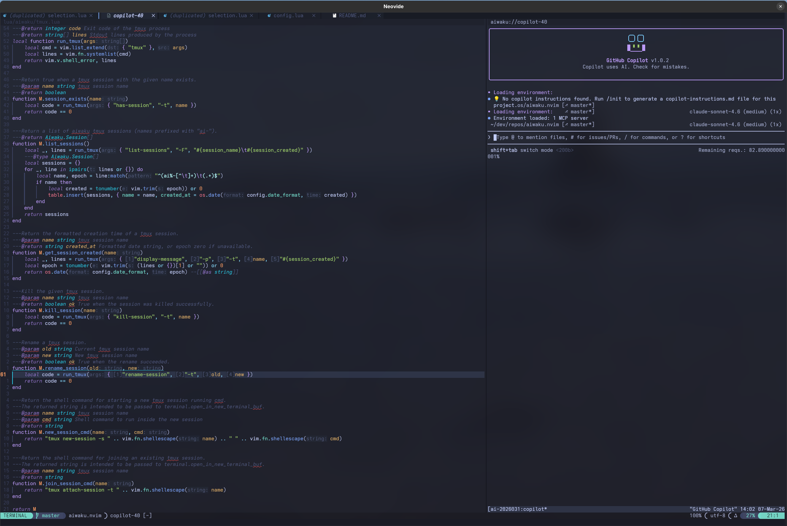

# aiwaku.nvim

A Neovim plugin that brings any CLI AI tool into your editor as a persistent sidebar panel.



aiwaku does not lock you into a specific AI tool. You point it at any command-line AI assistant — `copilot`, `claude`, `opencode`, `aider`, or anything else — and it runs it in a tmux session attached to a Neovim terminal split. Sessions survive window toggles, editor restarts, and workspace switches. Your conversation context is always one keymap away.

## Features

- **Tool-agnostic** — works with any CLI AI tool you configure
- **Persistent sessions** — backed by tmux; context survives toggling the panel or restarting Neovim
- **Human-readable session names** — auto-generated names like `ai-claude-quirky-tesla-a7f3` encode the tool and are easy to remember
- **Multiple sessions** — create, switch, and rename sessions without losing context
- **Send visual selection** — send selected code (with optional prompt prefix) directly to the AI
- **Send entire buffer** — send the full current file (with filename and filetype context) to the AI
- **LSP code actions** — send selections via the standard code action menu when null-ls is active
- **Sidebar layout** — opens as a left or right vertical split with configurable width
- **Async** — all tmux operations are non-blocking; the editor stays responsive

## Requirements

### System

| Dependency | Purpose |
|---|---|
| [tmux](https://github.com/tmux/tmux) ≥ 3.0 | Session persistence and management |
| Neovim ≥ 0.10 | Required for `vim.system` and modern API |

> [!NOTE]
> aiwaku requires tmux (>= 3.0) to provide persistent sessions. If tmux is not installed or not available on your PATH, session features (create, resume, list) will not work. Install tmux or ensure it is accessible from Neovim before using aiwaku.

### Neovim plugins

| Plugin | Purpose |
|---|---|
| [nvim-lua/plenary.nvim](https://github.com/nvim-lua/plenary.nvim) | Async job execution |
| [stevearc/dressing.nvim](https://github.com/stevearc/dressing.nvim) *(optional)* | Floating UI for `vim.ui.select`; without it Neovim falls back to the built-in command-line prompt. Other providers (e.g. telescope with the `ui-select` extension) also work. |
| [nvimtools/none-ls.nvim](https://github.com/nvimtools/none-ls.nvim) *(optional)* | LSP code actions integration |

## Installation

Using [lazy.nvim](https://github.com/folke/lazy.nvim):

```lua
{
  "juhaku/aiwaku.nvim",
  dependencies = {
        "nvim-lua/plenary.nvim",
        "stevearc/dressing.nvim", -- optional: floating UI for vim.ui.select (without it Neovim falls back to the built-in command-line prompt)
    },
  opts = { cmd = { "opencode" } } -- your CLI AI tool
}
```

## Setup

### Minimal

The only required option is `cmd` — the CLI AI tool(s) to run.

```lua
require("aiwaku").setup({
  cmd = { "opencode" },
})
```

`cmd` can be a plain string, a list (recommended, avoids shell quoting issues), or a list of
named tool definitions for multi-tool setups:

```lua
-- Single tool — all formats are equivalent and backward compatible:
cmd = "aider --model gpt-4o"
cmd = { "/usr/local/bin/claude", "--model", "claude-3-5-sonnet" }

-- Multi-tool — select the active tool at runtime with <leader>at:
cmd = {
  { name = "Claude", cmd = { "claude", "--dangerously-skip-permissions" } },
  { name = "Copilot", cmd = "copilot" },
  { name = "Aider",  cmd = { "aider", "--model", "gpt-4o" } },
}
```

When multiple tools are configured, use `<leader>at` (or `:lua require("aiwaku").select_tool()`)
to pick the active tool. New sessions are always created with the currently active tool.

<details>
<summary>Full default configuration</summary>

```lua
require("aiwaku").setup({
  -- CLI command to run inside the tmux session.
  -- Use a list to avoid shell quoting issues, or a plain string.
  cmd = { "copilot" },

  -- Sidebar width in columns.
  width = 80,

  -- Which side to open the sidebar on.
  position = "right", -- "right" | "left"

  -- When true, automatically sends Enter after content is dispatched to the AI
  -- terminal, triggering immediate processing without manual Enter press.
  auto_submit = false,

  -- When true, automatically restores the last-used AI session when a Neovim
  -- session is loaded via :source Session.vim or nvim -S.
  restore_on_session_load = true,

  -- Normal/visual mode keymaps.
  -- Key: mode list, Value: map of lhs -> { command, description }
  keymaps = {
    [{ "n" }] = {
      ["<leader>ai"] = {
        command = function() require("aiwaku").toggle() end,
        description = "Toggle Aiwaku",
      },
      ["<leader>an"] = {
        command = function() require("aiwaku").new_session() end,
        description = "Aiwaku: new session",
      },
      ["<leader>as"] = {
        command = function() require("aiwaku").select_session() end,
        description = "Aiwaku: select session",
      },
      ["<leader>ar"] = {
        command = function() require("aiwaku").rename_session() end,
        description = "Aiwaku: rename session",
      },
      ["<leader>ab"] = {
        command = function() require("aiwaku").send_buffer() end,
        description = "Aiwaku: send buffer",
      },
      ["<leader>ad"] = {
        command = function() require("aiwaku").send_diagnostic() end,
        description = "Aiwaku: send diagnostic",
      },
      ["<leader>at"] = {
        command = function() require("aiwaku").select_tool() end,
        description = "Aiwaku: select CLI tool",
      },
    },
    [{ "v" }] = {
      ["<leader>ai"] = {
        command = "<Esc><Cmd>lua require('aiwaku').send_selection()<CR>",
        description = "Aiwaku: send selection",
      },
    },
  },

  -- LSP code actions shown via null-ls/none-ls.
  -- Each entry needs a title; prompt is optional.
  lsp_code_actions = {
    { title = "AI: send selection" },
    { title = "AI: explain this code", prompt = "explain this code:" },
    { title = "AI: refactor this code", prompt = "refactor this code:" },
    { title = "AI: send this file", buffer = true },
    { title = "AI: explain this file", prompt = "explain this file:", buffer = true },
    { title = "AI: send diagnostics", diagnostic = true },
    { title = "AI: fix diagnostics", prompt = "Fix the following diagnostics:", diagnostic = true },
    { title = "AI: send file diagnostics", file_diagnostic = true },
  },

  -- Keymaps active only inside the terminal buffer.
  terminal_keymaps = {
    ["<C-w>h"] = { command = "<C-\\><C-n><C-w>h", description = "Focus left" },
    ["<C-w>l"] = { command = "<C-\\><C-n><C-w>l", description = "Focus right" },
    ["<C-a>i"] = {
      command = "<C-\\><C-n><Cmd>lua require('aiwaku').toggle()<CR>",
      description = "Toggle Aiwaku",
    },
    ["<C-a>r"] = {
      command = "<C-\\><C-n><Cmd>lua require('aiwaku').rename_session()<CR>",
      description = "Aiwaku: rename session",
    },
    ["<C-a>s"] = {
      command = "<C-\\><C-n><Cmd>lua require('aiwaku').select_session()<CR>",
      description = "Aiwaku: select session",
    },
    ["<C-a>n"] = {
      command = "<C-\\><C-n><Cmd>lua require('aiwaku').new_session()<CR>",
      description = "Aiwaku: new session",
    },
    ["<C-a>c"] = {
      command = "<C-\\><C-n><Cmd>lua require('aiwaku').clear_context()<CR>",
      description = "Aiwaku: clear context",
    },
    ["<C-a>t"] = {
      command = "<C-\\><C-n><Cmd>lua require('aiwaku').select_tool()<CR>",
      description = "Aiwaku: select CLI tool",
    },
    ["<C-o>"] = {
      command = "<C-\\><C-n><Cmd>lua require('aiwaku').open_cword_in_tab()<CR>",
      description = "Aiwaku: open file under cursor in new tab",
    },
  },
})
```

</details>

## Configuration Options

| Option | Type | Default | Description |
|---|---|---|---|
| `cmd` | `string \| string[] \| CliTool[]` | `{ "copilot" }` | CLI tool(s) to run. Old string/string[] formats are still accepted. |
| `width` | `integer` | `80` | Sidebar panel width in columns |
| `position` | `"right" \| "left"` | `"right"` | Side of the screen to open the panel |
| `auto_submit` | `boolean` | `false` | When true, sends Enter after content to trigger immediate AI processing |
| `restore_on_session_load` | `boolean` | `true` | When true, auto-restores the last-used AI session when a Neovim session is loaded |
| `keymaps` | `table` | see above | Normal/visual mode keymaps |
| `lsp_code_actions` | `{ title = string, prompt? = string, buffer? = boolean, diagnostic? = boolean, file_diagnostic? = boolean }[]` | see above | LSP code actions exposed through null-ls/none-ls |
| `terminal_keymaps` | `table` | see above | Keymaps active inside the terminal buffer |

## Default Keymaps

### Normal mode

| Key | Action |
|---|---|
| `<leader>ai` | Toggle the AI sidebar (open/close) |
| `<leader>an` | Start a new session |
| `<leader>as` | Select from existing sessions |
| `<leader>ar` | Rename the current session |
| `<leader>ab` | Send the current buffer to the AI |
| `<leader>ad` | Send the diagnostic under cursor (or all buffer diagnostics if none under cursor) to the AI |
| `<leader>at` | Select the active CLI tool |

### Visual mode

| Key | Action |
|---|---|
| `<leader>ai` | Send selected text to the AI |

### Terminal mode (inside the sidebar)

| Key | Action |
|---|---|
| `<C-w>h` | Move focus to the left window |
| `<C-w>l` | Move focus to the right window |
| `<C-a>i` | Toggle the AI sidebar (open/close) |
| `<C-a>s` | Select from existing sessions |
| `<C-a>n` | Start a new session |
| `<C-a>r` | Rename the current session |
| `<C-a>c` | Clear context (kill session and start fresh) |
| `<C-a>t` | Select the active CLI tool |
| `<C-o>` | Open file path under cursor in a new tab |


## LSP Code Actions

aiwaku ships a [null-ls](https://github.com/nvimtools/none-ls.nvim) source that exposes AI actions through the standard LSP code action menu (`:lua vim.lsp.buf.code_action()`).

### Setup

Register the source alongside your other null-ls sources:

```lua
local null_ls = require("null-ls")
null_ls.setup({
  sources = {
    require("aiwaku.lsp-code-actions"),
    -- your other sources...
  },
})
```

### Default actions

The following actions are included by default and appear in the code action menu for any filetype when null-ls is active on the buffer:

| Action | Behaviour |
|---|---|
| **AI: send selection** | Send selection without a prompt prefix |
| **AI: explain this code** | Prepend `"explain this code:"` before the selection |
| **AI: refactor this code** | Prepend `"refactor this code:"` before the selection |
| **AI: send this file** | Send the full buffer without a prompt prefix |
| **AI: explain this file** | Prepend `"explain this file:"` before the buffer content |
| **AI: send diagnostics** | Send cursor-line diagnostic(s) — only shown when cursor line has a diagnostic |
| **AI: fix diagnostics** | Prepend a fix prompt before cursor-line diagnostics — only shown when cursor line has a diagnostic |
| **AI: send file diagnostics** | Send all diagnostics for the current file — only shown when the buffer has any diagnostic |

Actions without `buffer`, `diagnostic`, or `file_diagnostic` call `send_selection()` internally. Actions with `buffer = true` call `send_buffer()`. Actions with `diagnostic = true` call `send_diagnostic()` and are only visible when the cursor line has a diagnostic. Actions with `file_diagnostic = true` call `send_file_diagnostics()` and are only visible when the buffer has at least one diagnostic. The sidebar is opened automatically if it is not already visible.

### Overriding the action list

You can replace the default action list during setup:

```lua
require("aiwaku").setup({
  cmd = { "opencode" },
  lsp_code_actions = {
    { title = "AI: send selection" },
    { title = "AI: write tests", prompt = "write tests for:" },
    { title = "AI: review this code", prompt = "review this code:" },
  },
})
```

Each entry requires a `title`. The `prompt` field is optional; when omitted, aiwaku sends the current selection without a prefix. Entries with `buffer = true` send the entire current buffer instead of the visual selection. Entries with `diagnostic = true` send cursor-line diagnostics and are only shown in the menu when the cursor line has a diagnostic. Entries with `file_diagnostic = true` send all buffer diagnostics and are only shown when the buffer has at least one diagnostic.

> **Note:** null-ls (or its community fork [none-ls](https://github.com/nvimtools/none-ls.nvim)) must be installed and have an active client attached to the buffer for code actions to appear.

## API

All functions are available on the `require("aiwaku")` table after calling `setup()`.

| Function | Description |
|---|---|
| `setup(opts)` | Initialize the plugin with your configuration |
| `toggle()` | Open or close the sidebar |
| `new_session(name?)` | Create a new AI session (uses the currently selected tool) |
| `select_session()` | Open a picker to switch sessions |
| `select_tool()` | Open a picker to change the active CLI tool |
| `rename_session()` | Rename the current session interactively |
| `clear_context()` | Kill the current session and start a fresh one |
| `send_selection(prompt?)` | Send the current visual selection to the AI (optional prompt prefix) |
| `send_buffer(prompt?)` | Send the entire current buffer to the AI (optional prompt prefix) |
| `send_diagnostic(prompt?)` | Send cursor-line diagnostics to the AI; falls back to all buffer diagnostics when none exist on the line |
| `send_file_diagnostics(prompt?)` | Send all diagnostics for the current buffer to the AI |
| `open_cword_in_tab()` | Open the file path under cursor (from AI output) in a new tab |
| `session_name()` | Return the display name of the active session, or `nil` when none is active |

### Session Naming

Sessions are created with auto-generated human-readable names in the format:

```
ai-<tool>-<adjective>-<noun>-<hex>
```

Examples:
- `ai-claude-quirky-tesla-a7f3`
- `ai-copilot-festive-hawking-c2e1`
- `ai-opencode-mysterious-shannon-9f4b`

The adjective-noun pair is drawn from a curated list of descriptive words and scientists' names (Docker-style), providing ~4,880 base combinations. The 4-character hex suffix adds ~65k variants, yielding **319 million** unique combinations to prevent collisions.

You can optionally pass a custom session name to `new_session(name)` to override the default naming:

```lua
require("aiwaku").new_session("my-custom-name")
```

### Sending selections with a prompt

You can call `send_selection` with a prefix to give the AI context:

```lua
-- From a keymap or command
require("aiwaku").send_selection("Explain this code:")
require("aiwaku").send_selection("Write tests for:")
require("aiwaku").send_selection("Refactor to be more idiomatic:")
```


### Sending diagnostics

`send_diagnostic` sends the LSP/diagnostic messages on the current cursor line. When no diagnostic exists on the cursor line it falls back to all diagnostics in the buffer:

```lua
require("aiwaku").send_diagnostic()
require("aiwaku").send_diagnostic("Fix the following error:")
```

`send_file_diagnostics` always sends every diagnostic in the current buffer:

```lua
require("aiwaku").send_file_diagnostics()
require("aiwaku").send_file_diagnostics("Please fix all these issues:")
```

Each diagnostic is formatted as `[SEVERITY] [source] file:line: message`. Both functions notify with a warning when no diagnostics are found.

### Sending the whole buffer

`send_buffer` captures all lines of the current buffer and prepends a file-context header (filename and filetype) before sending:

```lua
require("aiwaku").send_buffer()
require("aiwaku").send_buffer("Review this file for bugs:")
require("aiwaku").send_buffer("Write a README for this module:")
```

If the sidebar is not visible it is opened automatically before sending.

### Opening files from AI output

When the AI references a file (e.g. `src/parser.lua:42`), place the cursor on that path in the terminal and press `<C-o>` to open it in a new Neovim tab. Line numbers in the form `file.lua:42` or `file.lua:42:5` are parsed and the cursor jumps there automatically. If the path is not absolute, aiwaku tries to resolve it relative to the current working directory.

You can also open files from the terminal shell directly — aiwaku propagates `$NVIM` into the tmux session automatically:

```sh
nvim --server "$NVIM" --remote-tab src/parser.lua
```

## Statusline Integration

`session_name()` returns the display name of the active AI session (the `ai-` prefix is stripped), or `nil` when no session is active.

### lualine

```lua
{
  function()
    return " " .. (require("aiwaku").session_name() or "")
  end,
  cond = function()
    return require("aiwaku").session_name() ~= nil
  end,
}
```

### Plain statusline

```lua
_G.AiwakuStatusline = function()
  local name = require("aiwaku").session_name()
  return name and (" " .. name) or ""
end
vim.o.statusline = "% %f %=%l:%c"
```

## License

Licensed under [MIT](LICENSE) license at your option.

Unless you explicitly state otherwise, any contribution intentionally submitted for inclusion in this plugin
by you, shall be licensed as MIT, without any additional terms or conditions.
